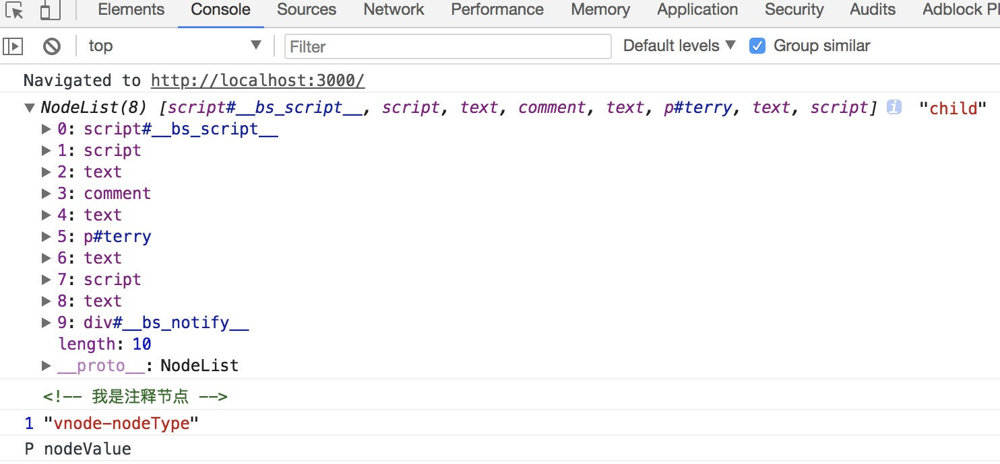

## 使用DOM API
DOM代表文档对象模型。它是XML和HTML等结构化文档的面向对象表示。
设置元素的textContent属性是在网页上输出文本的一种方式。例如，请考虑以下HTML标记：
```html
<p id="paragraph">Hello, World</p>
```
要更改其textContent属性，我们可以运行以下JavaScript：
```js
document.getElementById("paragraph").textContent = "Hello, World";
```
这将选择id段落并将其文本内容设置为“Hello，World”的元素：
```html
<p id="paragraph">Hello, World</p>
```
您也可以使用JavaScript以编程方式创建新的HTML元素。例如，考虑具有以下主体的HTML文档：
```html
<body>
<h1>Adding an element</h1>
</body>
```
在我们的JavaScript中，我们使用textContent属性创建一个新的<p>标签，并将其添加到html body的末尾：
```js
var element = document.createElement('p');
element.textContent = "Hello, World";
document.body.appendChild(element);
```
这会将您的HTML主体更改为以下内容：
```html
<body>
<h1>Adding an element</h1> <p>Hello, World</p>
</body>
```
## 扩展
### 常用DOM 节点的类型
节点类型 | 数值常量 | 字符常量(ie不支持) 
--- | --- | --- 
Element(元素节点) | 1 | ELEMENT_NODE 
Attr(属性节点) | 2 | ATTRIBUTE_NODE 
Text(文本节点) | 3 | TEXT_NODE 
Comment(注释节点) | 8 | COMMENT_NODE 
Document(文档节点) | 9 | DOCUMENT_NODE 
DocumentType(文档类型节点) | 10 | DOCUMENT_TYPE_NODE 
DocumentFragment(文档片段节点) | 11 | DOCUMENT_FRAGMENT_NODE
```html

<body>
  <!-- 我是注释节点 -->
  <p id='terry'>小生活平平淡淡</p>
  <script>
    const vnode = document.querySelector('#terry')
    const doc = document.getElementsByTagName('body')[0]
    let child = doc.childNodes
    console.log(child, 'child')
    console.log(child[3])
    console.log(vnode.nodeType, 'vnode-nodeType')
    console.log(vnode.nodeName, 'nodeValue')
  </script>
</body>
```
控制台输出：

大家感兴趣可以去看慕课网的有关[DOM 详解的教程](https://www.imooc.com/learn/488)