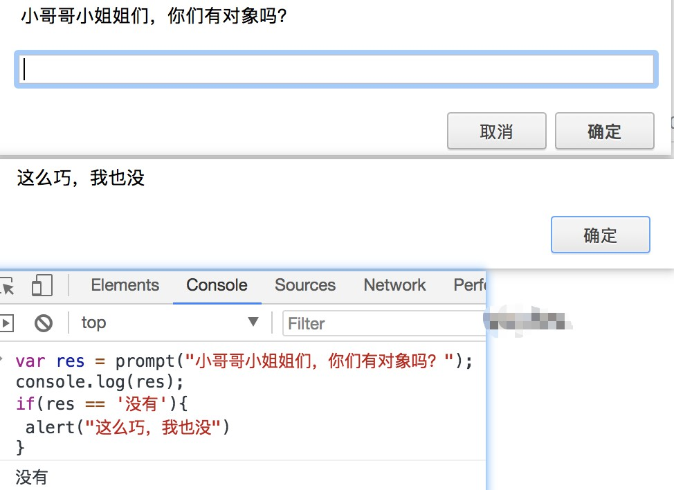

## 使用 window.prompt()
从用户获取输入的简单方法是使用prompt()方法
result = window.prompt(text, value);
* result 用来存储用户输入文字的字符串，或者是 null.
* text 用来提示用户输入文字的字符串,如果没有任何提示内容,该参数可以省略不写.
* value 文本输入框中的默认值,该参数也可以省略不写.不过在 Internet Explorer 7 和 8 中,省略该参数会导致输入框中显示默认值"undefined".
### 小例子
```js
var res = prompt("小哥哥小姐姐们，你们有对象吗？"); 
console.log(res); 
//🎯
if(res == '没有'){
 alert("这么巧，我也没")
}
```

## 笔记
当用户点击"确定"按钮后,文本输入框中的文字被返回.如果文本输入框中为空,则返回一个空字符串.如果用户点击"取消"按钮,则返回null.
Safari是一个例外，当用户单击Cancel时，该函数将返回一个空字符串。 从那里，您可以将返回值转换为另一种类型，例如整数。
## 扩展
[window.prompt()](https://developer.mozilla.org/zh-CN/docs/Web/API/Window/prompt)显示一个对话框,对话框中包含一条文字信息,用来提示用户输入文字.
```js
var sign = prompt("你是什么星座的?");
if (sign == "天蝎座"){
   alert("哇! 我也是天蝎座的耶!");
}
var sign = window.prompt('你觉得很幸运吗?','是的');
 //打开显示提示文本为"你觉得很幸运吗?"并且输入框默认值为"是的"的提示窗口
```
