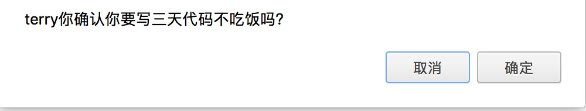
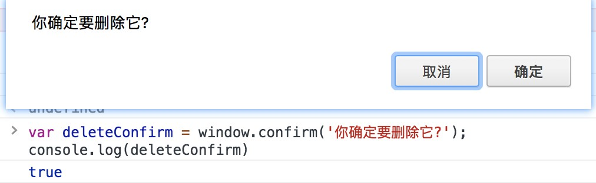

## 使用Using window.confirm()
window.confirm（）方法显示一个模式对话框，其中包含可选消息和两个按钮，即OK和Cancel。现在，让我们看看下面的例子：
```js
var result = window.confirm('terry你确认你要写三天代码不吃饭吗？');
```

这里，message是要显示在对话框中的可选字符串，结果是一个布尔值，指示是否
已选择确定或取消（true表示确定）。
window.confirm（）通常用于在执行危险操作（如在控制面板中删除某些内容）之前要求用户确认：
该代码的输出在浏览器中将如下所示：
如果您需要它以备后用，您可以将用户交互的结果存储在一个变量中：
```js
var deleteConfirm = window.confirm('你确定要删除它?');
console.log(deleteConfirm)// true || false
```

## 笔记
该参数是可选的，并且不是规范所要求的。
对话框是模式窗口 - 它们阻止用户访问程序界面的其余部分，直到对话框关闭。出于这个原因，你不应该过度使用任何创建对话框（或模态窗口）的函数。无论如何，避免使用对话框进行确认有很好的理由。
从Chrome 46.0开始，除非其沙箱属性的值为allow-modal，否则此方法在<iframe/>内部被阻止。
由于窗口对象始终是隐式的，所以在窗口符号被移除的情况下调用confirm方法是公认的。但是，建议显式定义窗口对象，因为预期的行为可能会因较低范围级别的实现而使用类似命名的方法更改。
## 扩展

