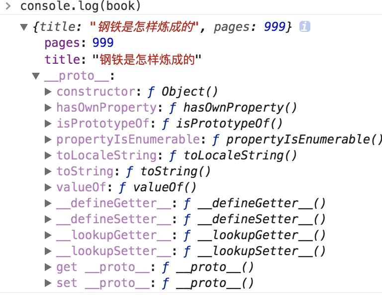

## 对象成员
对象成员包括属性和方法，在js中二者差别甚微。对象的一个命名成员可以包含热河数据类型。既然函数也是一种对象，那么对象成员除传统数据类型外，也可以包含一个函数，当一个被命名的成员引用了一个函数，该成员就会被称为一个“方法”,相反引用了一个非函数类型的成员就被称为属性。
## Prototypes（原型）
javascript中的对象是基于原型的。原型是其他对象的基础，定义并实现了一个新对象所必须具有的成员。这一概念不同传统面向对象编程中“类”的概念。它定义创建新对象的过程。原型对象为所有给定类型的对象实例所共享，因此所有实例共享原型对象的成员。  
对象通过一个内部属性绑定到它的原型。在Firefox,Safari, Chrome浏览器中，这个__proto__属性对开发者可见，而其他的浏览器却不允许访问此属性。你一旦创建一个内置对象（比如Object或者Array）的实例，它们就会自动拥有一个Object实例作为原型。  
因此，对象可以有两种成员类型：实例成员（也成为Own）成员和原型成员。实例成员直接存在于对象实例中，原型成员则从对象原型继承而来，实例：
```js
var book = {
  title:"钢铁是怎样炼成的",
  pages:999
};
console.log(book.toString()); //"[object Object]"
```
在这段代码中，对象book只有title 和pages两个实例成员，并没有定义toString()方法，但是这个方法却被执行，可以看出toString是由对象继承而来的原型成员。

处理对象成员的过程与变量处理十分相似。当 book.toString()被调用时，对成员进行名为“toString”的搜 索，首先从对象实例开始，如果 book 没有名为 toString 的成员，那么就转向搜索原形对象，在那里发现了 toString()方法并执行它。通过这种方法，book 可以访问它的原形所拥有的每个属性或方法。  

你可以使用 hasOwnProperty()函数确定一个对象是否具有特定名称的实例成员，(它的参数就是成员名 称)。要确定对象是否具有某个名称的属性，你可以使用操作符 in。例:
```js
var book = {
  title:"钢铁是怎样炼成的",
  pages:999
};
console.log(book.hasOwnProperty("title")); //true
console.log(book.hasOwnProperty("toString")); //false 
console.log("title" in book); //true
console.log("toString" in book); //true
```
此代码中，hasOwnProperty()传入“title”时返回 true，因为 title 是一个实例成员。传入“toString”时返回 false， 因为 toString 不在实例之中。如果使用 in 操作符检测这两个属性，那么返回都是 true，因为它既搜索实例 又搜索原形。  
对象的原形决定了一个实例的类型。默认情况下，所有对象都是 Object 的实例，并继承了所有基本方 法，如 toString()。你可以用“构造器”创建另外一种类型的原形。例如:
```js
function Book(title, publisher) {
  this.title = title;
  this.publisher = publisher;
}
Book.prototype.sayTitle = function () {
  alert(this.title);
};
var book1 = new Book("钢铁是怎样炼成的", "作者2");
var book2 = new Book("鲁宾逊漂流记", "作者1");
alert(book1 instanceof Book); //true
alert(book1 instanceof Object); //true
book1.sayTitle(); //"钢铁是怎样炼成的"
alert(book1.toString()); //"[object Object]"
```
Book 构造器用于创建一个新的 Book 实例。book1 的原形(__proto__)是 Book.prototype，Book.prototype 的原形是 Object。这就创建了一个原形链，book1 和 book2 继承了它们的成员。  
注意，两个 Book 实例共享同一个原形链。每个实例拥有自己的 title 和 publisher 属性，但其他成员均继 承自原形。当 book1.toString()被调用时，搜索工作必须深入原形链才能找到对象成员“toString”。正如你所 怀疑的那样，深入原形链越深，搜索的速度就会越慢。   
虽然使用优化 JavaScript 引擎的新式浏览器在此任务中表现良好，但是老的浏览器，特别是 Internet Explorer 和 Firefox 3.5，每深入原形链一层都会增加性能损失。记住，搜索实例成员的过程比访问直接量 或者局部变量负担更重，所以增加遍历原形链的开销正好放大了这种效果。  


