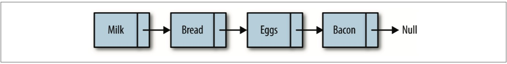
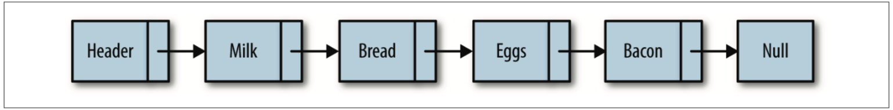
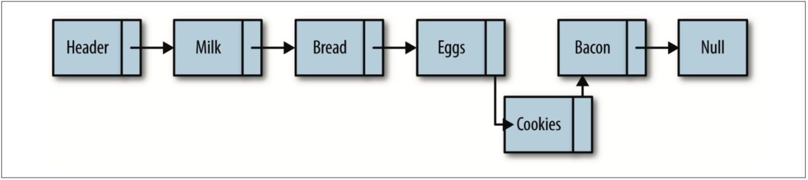
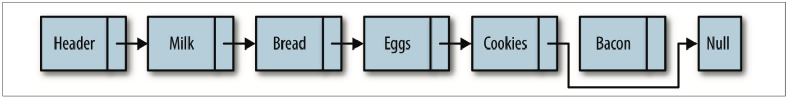
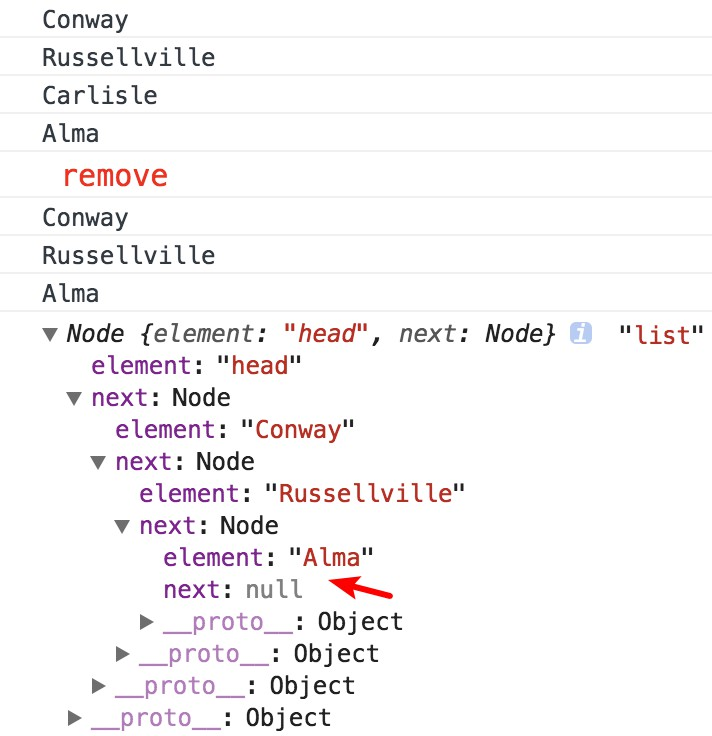
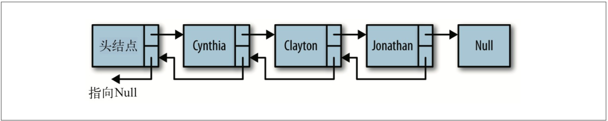
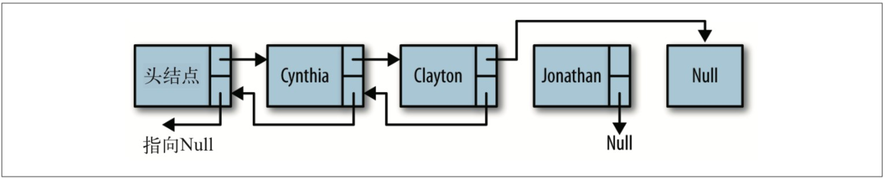

## 数组的缺点

数组不总是组织数据的最佳数据结构，原因如下。在很多编程语言中，数组的长度是固定 的，所以当数组已被数据填满时，再要加入新的元素就会非常困难。在数组中，添加和删 除元素也很麻烦，因为需要将数组中的其他元素向前或向后平移，以反映数组刚刚进行了 添加或删除操作。然而，JavaScript 的数组并不存在上述问题，因为使用 split() 方法不需 要再访问数组中的其他元素了。
JavaScript 中数组的主要问题是，它们被实现成了对象，与其他语言(比如 C++ 和 Java) 的数组相比，效率很低。
如果你发现数组在实际使用时很慢，就可以考虑使用链表来替代它。除了对数据的随机访 问，链表几乎可以用在任何可以使用一维数组的情况中。如果需要随机访问，数组仍然是 更好的选择。

## 定义链表

链表是由一组节点组成的集合。每个节点都使用一个对象的引用指向它的后继。指向另一 个节点的引用叫做链。下图展示了一个链表。

数组元素靠它们的位置进行引用，链表元素则是靠相互之间的关系进行引用。在图 6-1 中， 我们说 bread 跟在 milk 后面，而不说 bread 是链表中的第二个元素。遍历链表，就是跟着 链接，从链表的首元素一直走到尾元素(但这不包含链表的头节点，头节点常常用来作为 链表的接入点)。图中另外一个值得注意的地方是，链表的尾元素指向一个 null 节点。
然而要标识出链表的起始节点却有点麻烦，许多链表的实现都在链表最前面有一个特殊节 点，叫做头节点。经过改造之后，图中的链表成了下面的样子。

链表中插入一个节点的效率很高。向链表中插入一个节点，需要修改它前面的节点(前 驱)，使其指向新加入的节点，而新加入的节点则指向原来前驱指向的节点。图中演示了 如何在 eggs 后加入 cookies。

从链表中删除一个元素也很简单。将待删除元素的前驱节点指向待删除元素的后继节点，同时将待删除元素指向 null，元素就删除成功了。图中演示了从链表中删除“bacon”的过程。
链表还有其他一些操作，但插入和删除元素最能说明链表为什么如此有用。


## 基于对象的链表

我们设计的链表包含两个类。Node 类用来表示节点，LinkedList 类提供了插入节点、删除节点、显示列表元素的方法，以及其他一些辅助方法。

### Node 类

Node 类包含两个属性:element 用来保存节点上的数据，next 用来保存指向下一个节点的链接。我们使用一个构造函数来创建节点，该构造函数设置了这两个属性的值:

```js
function Node(element) {
  this.element = element;
  this.next = null;
}
```

head 节点的 next 属性被初始化为 null，当有新元素插入时，next 会指向新的元素，所以
在这里我们没有修改 next 的值。

### LinkedList 类

List 类提供了对链表进行操作的方法。该类的功能包括插入删除节点、在列表中查找给 定的值。该类也有一个构造函数，链表只有一个属性，那就是使用一个 Node 对象来保存该 链表的头节点。该类的构造函数如下所示:

```js
function LList() {
  this.head = new Node('head');
  this.find = find;
  this.insert = insert;
  this.remove = remove;
  this.display = display;
}
```

### 插入新节点

我们要分析的第一个方法是 insert，该方法向链表中插入一个节点。向链表中插入新节点 时，需要明确指出要在哪个节点前面或后面插入。首先介绍如何在一个已知节点后面插入 元素。
在一个已知节点后面插入元素时，先要找到“后面”的节点。为此，创建一个辅助方法 find()，该方法遍历链表，查找给定数据。如果找到数据，该方法就返回保存该数据的节 点。find() 方法的实现代码如下所示:

```js
function find(item) {
  var currNode = this.head;
  while (currNode.element != item) {
    currNode = currNode.next;
  }
  return currNode;
}
```

find() 方法演示了如何在链表上进行移动。首先，创建一个新节点，并将链表的头节点赋 给这个新创建的节点。然后在链表上进行循环，如果当前节点的 element 属性和我们要找 的信息不符，就从当前节点移动到下一个节点。如果查找成功，该方法返回包含该数据的 节点;否则，返回 null。
一旦找到“后面”的节点，就可以将新节点插入链表了。首先，将新节点的 next 属性设 置为“后面”节点的 next 属性对应的值。然后设置“后面”节点的 next 属性指向新节点。 insert() 方法的定义如下:

```js
function insert(newElement, item) {
  var newNode = new Node(newElement);
  var current = this.find(item);
  newNode.next = current.next;
  current.next = newNode;
}
```

现在已经可以开始测试我们的链表实现了。然而在测试之前，先来定义一个 display() 方法，该方法用来显示链表中的元素:

```js
function display() {
  var currNode = this.head;
  while (!(currNode.next == null)) {
    print(currNode.next.element);
    currNode = currNode.next;
  }
}
```

该方法先将列表的头节点赋给一个变量，然后循环遍历链表，当前节点的 next 属性为 null 时循环结束。为了只显示包含数据的节点(换句话说，不显示头节点)，程序只访问 当前节点的下一个节点中保存的数据:
 currNode.next.element
最后，再加一点代码，来试试新定义的链表。例 6-1 将 40 号州际公路沿线的阿肯色州西 部的城市存储到一个链表，这段程序还包括截至目前对 LList 类的定义。需要注意的是 remove() 方法暂时被注释掉了，下一节将定义这个方法。

### LList 类和测试程序

```js
function Node(element) {
  this.element = element;
  this.next = null;
}
function LList() {
  this.head = new Node('head');
  this.find = find;
  this.insert = insert; //this.remove = remove;
  this.display = display;
}

function find(item) {
  var currNode = this.head;
  while (currNode.element != item) {
    currNode = currNode.next;
  }
  return currNode;
}

function insert(newElement, item) {
  var newNode = new Node(newElement);
  var current = this.find(item);
  newNode.next = current.next;
  current.next = newNode;
}

function display() {
  var currNode = this.head;
  while (!(currNode.next == null)) {
    console.log(currNode.next.element);
    currNode = currNode.next;
  }
}
// 主程序
var cities = new LList();
cities.insert('Conway', 'head');
cities.insert('Russellville', 'Conway');
cities.insert('Alma', 'Russellville');
cities.display();
```

### 链表中删除

从链表中删除节点时，需要先找到待删除节点前面的节点。找到这个节点后，修改它的 next 属性，使其不再指向待删除节点，而是指向待删除节点的下一个节点。我们可以定义 一个方法 findPrevious()，来做这件事。
该方法遍历链表中的元素，检查每一个节点的下 一个节点中是否存储着待删除数据。如果找到，返回该节点(即“前一个”节点)，这样 就可以修改它的 next 属性了。findPrevious() 方法的定义如下:

```js
function findPrevious(item) {
  var currNode = this.head;
  while (!(currNode.next == null) && currNode.next.element != item) {
    currNode = currNode.next;
  }
  return currNode;
}
//现在就可以开始写 remove() 方法了:
function remove(item) {
  var prevNode = this.findPrevious(item);
  if (!(prevNode.next == null)) {
    prevNode.next = prevNode.next.next;
  }
}
```

该方法中最重要的一行代码如下，看起来有点奇怪，但是完全说得通
 prevNode.next = prevNode.next.next;

这里跳过了待删除节点，让“前一个”节点指向了待删除节点的后一个节点。如果你对这 个操作还是不太理解，
可参考下图，图片看起来更加形象。
又到了测试代码的时候，这次先得修改 LList 类的构造函数，使其包含这两个新加的方法:


```js
function LList() {
  this.head = new Node('head');
  this.find = find;
  this.insert = insert;
  this.display = display;
  this.findPrevious = findPrevious;
  this.remove = remove;
}
```

提供了一小段测试 remove() 方法的程序:
测试 remove() 方法

```js
var cities = new LList();
cities.insert('Conway', 'head');
cities.insert('Russellville', 'Conway');
cities.insert('Carlisle', 'Russellville');
cities.insert('Alma', 'Carlisle');
cities.display();
console.log('%c remove ', 'color: red; font-size: 15px;');
cities.remove('Carlisle');
cities.display();
console.log(cities.head, 'list');
```


完整代码如下

```js
function Node(element) {
  this.element = element;
  this.next = null;
}

function LList() {
  this.head = new Node('head');
  this.find = find;
  this.insert = insert; //this.remove = remove;
  this.display = display;
  this.remove = remove;
  this.findPrevious = findPrevious;
}

function find(item) {
  var currNode = this.head;
  while (currNode.element != item) {
    currNode = currNode.next;
  }
  return currNode;
}

function insert(newElement, item) {
  var newNode = new Node(newElement);
  var current = this.find(item);
  newNode.next = current.next;
  current.next = newNode;
}

function display() {
  var currNode = this.head;
  while (!(currNode.next == null)) {
    console.log(currNode.next.element);
    currNode = currNode.next;
  }
}

function findPrevious(item) {
  var currNode = this.head;
  while (!(currNode.next == null) && currNode.next.element != item) {
    currNode = currNode.next;
  }
  return currNode;
}

function remove(item) {
  var prevNode = this.findPrevious(item);
  if (!(prevNode.next == null)) {
    prevNode.next = prevNode.next.next;
  }
}
var cities = new LList();
cities.insert('大哥', 'head');
cities.insert('二哥', '大哥');
cities.insert('三哥', '二哥');
cities.insert('四哥', '三哥');
cities.display();
console.log(cities.head, 'list before');
console.log('%c remove 三哥', 'color: red; font-size: 15px;');
cities.remove('三哥');
cities.display();
console.log(cities.head, 'list');
```

### 双向链表

尽管从链表的头节点遍历到尾节点很简单，但反过来，从后向前遍历则没那么简单。通过 给 Node 对象增加一个属性，该属性存储指向前驱节点的链接，这样就容易多了。此时向链 表插入一个节点需要更多的工作，我们需要指出该节点正确的前驱和后继。但是在从链表 中删除节点时，效率提高了，不需要再查找待删除节点的前驱节点了。图中演示了双向 链表的工作原理。

首当其冲的是要为 Node 类增加一个 previous 属性：

```js
function Node(element) {
  this.element = element;
  this.next = null;
  this.previous = null;
}
```

双向链表的 insert() 方法和单向链表的类似，但是需要设置新节点的 previous 属性，使 其指向该节点的前驱。该方法的定义如下:

```js
function insertDouble(newElement, item) {
  var newNode = new Node(newElement);
  var current = this.find(item);
  newNode.next = current.next;
  newNode.previous = current;
  current.next = newNode;
}
```

双向链表的 remove() 方法比单向链表的效率更高，因为不需要再查找前驱节点了。首先需 要在链表中找出存储待删除数据的节点，然后设置该节点前驱的 next 属性，使其指向待删 除节点的后继;设置该节点后继的 previous 属性，使其指向待删除节点的前驱。下图直观地展示了该过程。


```js
// remove() 方法的定义如下:
function remove(item) {
  var currNode = this.find(item);
  if (!(currNode.next == null)) {
    currNode.previous.next = currNode.next;
    currNode.next.previous = currNode.previous;
    currNode.next = null;
    currNode.previous = null;
  }
}
```

为了完成以反序显示链表中元素这类任务，需要给双向链表增加一个工具方法，用来查找 最后的节点。findLast() 方法找出了链表中的最后一个节点，同时免除了从前往后遍历链 表之苦:

```js
function findLast() {
  var currNode = this.head;
  while (!(currNode.next == null)) {
    currNode = currNode.next;
  }
  return currNode;
}
```

有了这个工具方法，就可以写一个方法，反序显示双向链表中的元素。dispReverse() 方 法如下所示:

```js
function dispReverse() {
  var currNode = this.head;
  currNode = this.findLast();
  while (!(currNode.previous == null)) {
    print(currNode.element);
    currNode = currNode.previous;
  }
}
```

双向链表所有实现代码

```js
function Node(element) {
  this.element = element;
  this.next = null;
  this.previous = null;
}
function LList() {
  this.head = new Node('head');
  this.find = find;
  this.insert = insert;
  this.display = display;
  this.remove = remove;
  this.findLast = findLast;
  this.dispReverse = dispReverse;
}
function dispReverse() {
  var currNode = this.head;
  currNode = this.findLast();
  while (!(currNode.previous == null)) {
    console.log(currNode.element);
    currNode = currNode.previous;
  }
}
function findLast() {
  var currNode = this.head;
  while (!(currNode.next == null)) {
    currNode = currNode.next;
  }
  return currNode;
}
function remove(item) {
  var currNode = this.find(item);
  if (!(currNode.next == null)) {
    currNode.previous.next = currNode.next;
    currNode.next.previous = currNode.previous;
    currNode.next = null;
    currNode.previous = null;
  }
}
//findPrevious 没用了，注释掉
/*function findPrevious(item) {
var currNode = this.head;
while (!(currNode.next == null) &&
      (currNode.next.element != item)) {
 currNode = currNode.next;
}
return currNode;
}*/
function display() {
  var currNode = this.head;
  while (!(currNode.next == null)) {
    console.log(currNode.next.element);
    currNode = currNode.next;
  }
}
function find(item) {
  var currNode = this.head;
  while (currNode.element != item) {
    currNode = currNode.next;
  }
  return currNode;
}
function insert(newElement, item) {
  var newNode = new Node(newElement);
  var current = this.find(item);
  newNode.next = current.next;
  newNode.previous = current;
  current.next = newNode;
}
var cities = new LList();
cities.insert('大哥', 'head');
cities.insert('二哥', '大哥');
cities.insert('三哥', '二哥');
cities.insert('四哥', '三哥');
cities.display();
console.log(cities.head, 'list before');
console.log('%c remove 三哥', 'color: red; font-size: 15px;');
cities.remove('三哥');
cities.display();
console.log(cities.head, 'list');
```

## 循环链表

循环链表和单向链表相似，节点类型都是一样的。唯一的区别是，在创建循环链表时，让
其头节点的 next 属性指向它本身，即:
head.next = head
这种行为会传导至链表中的每个节点，使得每个节点的 next 属性都指向链表的头节点。换 句话说，链表的尾节点指向头节点，形成了一个循环链表，如图所示。

如果你希望可以从后向前遍历链表，但是又不想付出额外代价来创建一个双向链表，那么
就需要使用循环链表。从循环链表的尾节点向后移动，就等于从后向前遍历链表。 创建循环链表，只需要修改 LList 类的构造函数:

```js
function LList() {
  this.head = new Node('head');
  this.head.next = this.head;
  this.find = find;
  this.insert = insert;
  this.display = display;
  this.findPrevious = findPrevious;
  this.remove = remove;
}
```

只需要修改一处，就将单向链表变成了循环链表。但是其他一些方法需要修改才能工作正 常。比如，display() 就需要修改，原来的方式在循环链表里会陷入死循环。while 循环的 循环条件需要修改，需要检查头节点，当循环到头节点时退出循环。

```js
function display() {
  var currNode = this.head;
  while (!(currNode.next == null) && !(currNode.next.element == 'head')) {
    console.log(currNode.next.element);
    currNode = currNode.next;
  }
}
```
