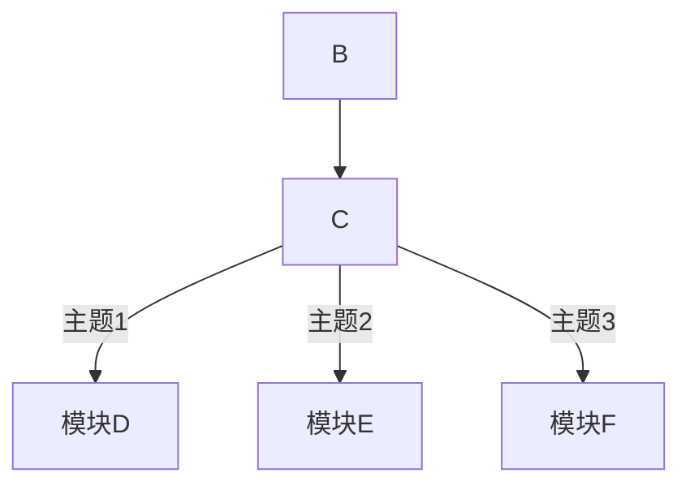

## 什么是金字塔原理

### 大脑思维

> 左脑:

- 一般负责数字和逻辑推理
  > 右脑：
- 负责艺术性，感情，创造力，空间思维等
  > 胼胝体（中间的神经细胞）
- 负责左右脑互换，越发达，思考越快

### 金字塔原理

#### 是什么

- 法则
- 规则
- 结构
- 方法

#### 为什么

- 内容有条理
- 文字密度低
- 耗费时间少

#### 怎么用

- TOPS 原则
- MECE 法则
- SCQA 结构

### 金字塔原理四大用途

- 解决问题
- 管理下属
- 表达思想
- 公文写作

### 原理改变

- 制作时间减少
- 文字密度降低
- 内容更加条理

### 如何做

- 共性、分组、记忆
- 魔力数字 7，超过 7 个进行分类，归类，受众容易接受
- 先表达结论

## 金字塔法则

- 先从结论说起
- 再说中心思想
- 再展开逻辑推导

## 金字塔法则二

- T 有的放失（Targeted）
- O 贯穿整体（OVer-arching)
- P 掷地有声（PowerFul）
- S 言之有据（Supportable)

## 金字塔法则三

- 序言=》中心思想=》主题=》子主题

## 序言常用叙事手法（SCQA 结构）

- Situation 背景
  首先是时间发生的时间，地点等要素，这就构成了状况
- Complication 冲突
  在这一状况中，产生了某种困难或复杂性
- Question 疑问
  这种复杂性使读者脑海中产生了一个疑问
- Answer 解答
  你就是要对这个以为给出解答，而这一解答就位于金字塔的定点
